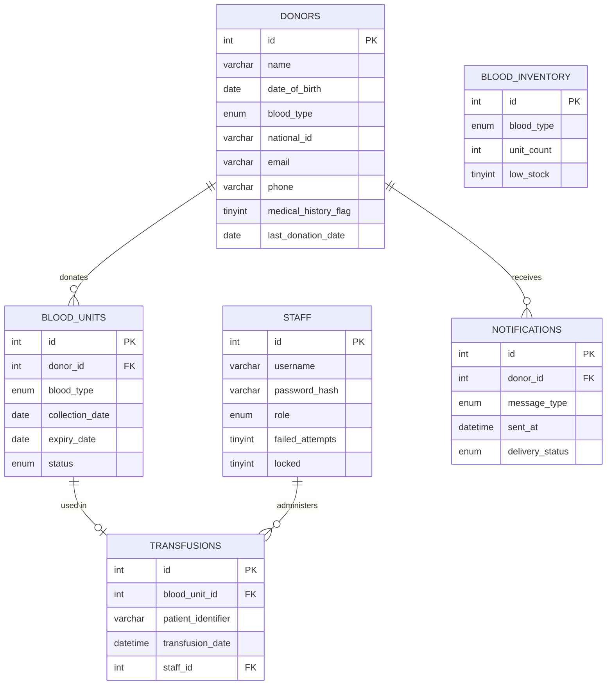

# Design Document: KNH Blood Donation Management System (BDMS)

## Overview

The KNH BDMS is a PHP/MySQL web application that manages the full lifecycle of blood donation at Kenyatta National Hospital. It covers donor registration and eligibility screening, blood unit collection and inventory management, transfusion tracking, and donor notifications. The system exposes a RESTful API consumed by an HTML/CSS/JS frontend, runs on Apache (XAMPP/WAMP), and enforces role-based access control for hospital staff.

### Key Design Goals

- Data integrity enforced at the database layer (constraints, foreign keys)
- Security via PDO prepared statements, password hashing, and RBAC sessions
- Separation of concerns: config, API endpoints, business logic classes, and frontend templates are distinct layers
- Stateless API responses (JSON) with appropriate HTTP status codes
- Minimal external dependencies — standard PHP 8.x + MySQL 8.x + vanilla JS

---

## Architecture

The system follows a classic three-tier architecture:

```
┌─────────────────────────────────────────────────────────┐
│                    Browser (Client)                      │
│  HTML/CSS/JS  ──  Fetch API  ──  Form Handlers          │
└────────────────────────┬────────────────────────────────┘
                         │ HTTP (JSON)
┌────────────────────────▼────────────────────────────────┐
│                  Apache / PHP Backend                    │
│                                                          │
│  api/                  ← RESTful endpoint files          │
│  ├── donors.php                                          │
│  ├── blood_units.php                                     │
│  ├── inventory.php                                       │
│  ├── transfusions.php                                    │
│  └── notifications.php                                   │
│                                                          │
│  src/                  ← Business logic classes          │
│  ├── EligibilityChecker.php                              │
│  ├── CompatibilityEngine.php                             │
│  ├── NotificationService.php                             │
│  ├── InventoryManager.php                                │
│  └── Auth.php                                            │
│                                                          │
│  config/               ← Environment & DB connection     │
│  ├── db.php  (gitignored)                                │
│  └── db.example.php                                      │
└────────────────────────┬────────────────────────────────┘
                         │ PDO
┌────────────────────────▼────────────────────────────────┐
│                  MySQL 8.x  (knh_bdms_db)                │
│  donors │ blood_units │ blood_inventory                  │
│  transfusions │ notifications │ staff                    │
└─────────────────────────────────────────────────────────┘
```

### Request Lifecycle

1. Browser sends a Fetch API request to an `api/*.php` endpoint.
2. The endpoint file validates the HTTP method and calls `Auth::requireRole()` to enforce RBAC.
3. The endpoint delegates to the appropriate business logic class.
4. The business logic class uses PDO prepared statements to interact with MySQL.
5. The endpoint serialises the result to JSON and sets the HTTP status code.

---

## Components and Interfaces

### 1. Database Connection (`config/db.php`)

Returns a singleton PDO instance. Credentials are read from environment variables (or a local `.env` file excluded from VCS). Throws `PDOException` on failure; the caller is responsible for catching and returning HTTP 500.

```php
// Returns PDO instance
function getDbConnection(): PDO
```

### 2. Auth (`src/Auth.php`)

Manages staff login, session lifecycle, and RBAC enforcement.

```php
class Auth {
    public static function login(string $username, string $password): array|false
    public static function logout(): void
    public static function requireRole(string|array $roles): void  // exits with 401/403 on failure
    public static function currentStaff(): ?array
    public static function incrementFailedAttempts(int $staffId): void
    public static function lockAccount(int $staffId): void
}
```

Session payload: `['staff_id' => int, 'role' => string, 'last_active' => int]`

Session timeout is checked on every `requireRole()` call; stale sessions are destroyed and HTTP 401 is returned.

### 3. EligibilityChecker (`src/EligibilityChecker.php`)

```php
class EligibilityChecker {
    public function verifyEligibility(int $donorId): array
    // Returns: ['eligible' => bool, 'reason' => string|null]
    // Reasons: 'minimum interval not met' | 'medical disqualification' | 'donor not found'
}
```

### 4. CompatibilityEngine (`src/CompatibilityEngine.php`)

```php
class CompatibilityEngine {
    public function findCompatibleUnits(string $patientBloodType, int $requestedUnits): array
    // Returns: ['units' => array, 'shortage' => bool]
    // Error: ['error' => 'invalid blood type']
}
```

ABO/Rh compatibility table (donor → recipient):

| Donor  | Compatible Recipients              |
|--------|------------------------------------|
| O-     | O-, O+, A-, A+, B-, B+, AB-, AB+  |
| O+     | O+, A+, B+, AB+                    |
| A-     | A-, A+, AB-, AB+                   |
| A+     | A+, AB+                            |
| B-     | B-, B+, AB-, AB+                   |
| B+     | B+, AB+                            |
| AB-    | AB-, AB+                           |
| AB+    | AB+                                |

Units are ordered by earliest expiry date first (FIFO expiry).

### 5. InventoryManager (`src/InventoryManager.php`)

```php
class InventoryManager {
    public function updateInventory(int $bloodUnitId): void
    public function expireUnits(): void          // marks expired units, decrements counts
    public function getInventory(): array        // returns all blood types with counts and low_stock flag
    public function isLowStock(string $bloodType): bool
}
```

Low-stock threshold: < 10 units.

### 6. NotificationService (`src/NotificationService.php`)

```php
class NotificationService {
    public function sendNotification(int $donorId, string $messageType): array
    // messageType: 'eligibility_reminder' | 'low_stock_alert'
    // Returns: ['success' => bool, 'notification_id' => int|null, 'error' => string|null]
}
```

The service writes a `notifications` record before dispatching. On dispatch failure it updates the record's `delivery_status` to `'failed'` and logs the error.

### 7. API Endpoints

Each endpoint file follows this pattern:

```php
<?php
require_once '../config/db.php';
require_once '../src/Auth.php';

header('Content-Type: application/json');
session_start();

$method = $_SERVER['REQUEST_METHOD'];
// route by $method, call Auth::requireRole(), delegate to class, echo json_encode(...)
```

| File                       | Methods         | Roles Allowed                        |
|----------------------------|-----------------|--------------------------------------|
| `api/donors.php`           | GET, POST, PUT  | Admin, Nurse (POST/PUT), Lab (GET)   |
| `api/blood_units.php`      | GET, POST       | Admin, Nurse                         |
| `api/inventory.php`        | GET, PUT        | Admin, Lab_Technician                |
| `api/transfusions.php`     | GET, POST       | Admin, Nurse                         |
| `api/notifications.php`    | GET, POST       | Admin                                |

### 8. Frontend Templates

| File                       | Purpose                                      |
|----------------------------|----------------------------------------------|
| `index.html`               | Login form                                   |
| `register_donor.html`      | Donor registration form                      |
| `donor_dashboard.html`     | Donor search, eligibility check              |
| `inventory_dashboard.html` | Real-time inventory view (30s auto-refresh)  |
| `transfusion_form.html`    | Compatibility search + transfusion recording |

All forms use the Fetch API; responses update the DOM without page reload.

---

## Data Models

### `staff`

| Column              | Type           | Constraints                        |
|---------------------|----------------|------------------------------------|
| id                  | INT            | PK, AUTO_INCREMENT                 |
| username            | VARCHAR(50)    | NOT NULL, UNIQUE                   |
| password_hash       | VARCHAR(255)   | NOT NULL                           |
| role                | ENUM(...)      | NOT NULL ('Administrator','Nurse','Lab_Technician') |
| failed_attempts     | TINYINT        | NOT NULL DEFAULT 0                 |
| locked              | TINYINT(1)     | NOT NULL DEFAULT 0                 |
| created_at          | DATETIME       | NOT NULL DEFAULT CURRENT_TIMESTAMP |

### `donors`

| Column              | Type           | Constraints                        |
|---------------------|----------------|------------------------------------|
| id                  | INT            | PK, AUTO_INCREMENT                 |
| name                | VARCHAR(100)   | NOT NULL                           |
| date_of_birth       | DATE           | NOT NULL                           |
| blood_type          | ENUM(...)      | NOT NULL ('A+','A-','B+','B-','AB+','AB-','O+','O-') |
| national_id         | VARCHAR(20)    | NOT NULL, UNIQUE                   |
| email               | VARCHAR(100)   | NOT NULL, UNIQUE                   |
| phone               | VARCHAR(20)    | NOT NULL                           |
| medical_history_flag| TINYINT(1)     | NOT NULL DEFAULT 0                 |
| last_donation_date  | DATE           | NULL                               |
| created_at          | DATETIME       | NOT NULL DEFAULT CURRENT_TIMESTAMP |

### `blood_units`

| Column              | Type           | Constraints                        |
|---------------------|----------------|------------------------------------|
| id                  | INT            | PK, AUTO_INCREMENT                 |
| donor_id            | INT            | NOT NULL, FK → donors.id           |
| blood_type          | ENUM(...)      | NOT NULL                           |
| collection_date     | DATE           | NOT NULL                           |
| expiry_date         | DATE           | NOT NULL (collection_date + 42d)   |
| status              | ENUM(...)      | NOT NULL DEFAULT 'available' ('available','transfused','expired') |
| created_at          | DATETIME       | NOT NULL DEFAULT CURRENT_TIMESTAMP |

### `blood_inventory`

| Column              | Type           | Constraints                        |
|---------------------|----------------|------------------------------------|
| id                  | INT            | PK, AUTO_INCREMENT                 |
| blood_type          | ENUM(...)      | NOT NULL, UNIQUE                   |
| unit_count          | INT            | NOT NULL DEFAULT 0                 |
| low_stock           | TINYINT(1)     | NOT NULL DEFAULT 0                 |
| updated_at          | DATETIME       | NOT NULL DEFAULT CURRENT_TIMESTAMP ON UPDATE CURRENT_TIMESTAMP |

### `transfusions`

| Column              | Type           | Constraints                        |
|---------------------|----------------|------------------------------------|
| id                  | INT            | PK, AUTO_INCREMENT                 |
| blood_unit_id       | INT            | NOT NULL, FK → blood_units.id      |
| patient_identifier  | VARCHAR(50)    | NOT NULL                           |
| transfusion_date    | DATETIME       | NOT NULL DEFAULT CURRENT_TIMESTAMP |
| staff_id            | INT            | NOT NULL, FK → staff.id            |

### `notifications`

| Column              | Type           | Constraints                        |
|---------------------|----------------|------------------------------------|
| id                  | INT            | PK, AUTO_INCREMENT                 |
| donor_id            | INT            | NOT NULL, FK → donors.id           |
| message_type        | ENUM(...)      | NOT NULL ('eligibility_reminder','low_stock_alert') |
| sent_at             | DATETIME       | NOT NULL DEFAULT CURRENT_TIMESTAMP |
| delivery_status     | ENUM(...)      | NOT NULL DEFAULT 'pending' ('pending','sent','failed') |

### Entity Relationship Diagram



---

## Correctness Properties

*A property is a characteristic or behavior that should hold true across all valid executions of a system — essentially, a formal statement about what the system should do. Properties serve as the bridge between human-readable specifications and machine-verifiable correctness guarantees.*

### Property 1: Every table has a primary key

*For any* table in `knh_bdms_db`, querying `INFORMATION_SCHEMA.TABLE_CONSTRAINTS` should return at least one constraint of type `PRIMARY KEY` for that table.

**Validates: Requirements 1.3**

---

### Property 2: NOT NULL constraints are enforced on required columns

*For any* required column in any table, attempting to insert a row with NULL in that column should result in a database error (constraint violation), leaving the table unchanged.

**Validates: Requirements 1.5**

---

### Property 3: Donor registration round-trip

*For any* valid donor data (unique national_id, unique email, valid blood type, non-empty required fields), submitting a registration should result in a new record in `donors` whose stored fields exactly match the submitted values, and the returned donor ID should be unique across all existing donors.

**Validates: Requirements 3.1, 3.4**

---

### Property 4: Duplicate donor registration is rejected

*For any* donor already present in the system, submitting a registration with the same `national_id` or the same `email` should return HTTP 409, and no new record should be inserted into `donors`.

**Validates: Requirements 3.2**

---

### Property 5: Incomplete registration is rejected with field list

*For any* registration submission that omits one or more required fields, the response should be HTTP 422 and the response body should list every missing field name.

**Validates: Requirements 3.3**

---

### Property 6: Eligibility check correctness

*For any* donor in the system:
- If `last_donation_date` is within 56 days of today, `verifyEligibility` should return `eligible=false` with reason `"minimum interval not met"`.
- If `medical_history_flag=1`, `verifyEligibility` should return `eligible=false` with reason `"medical disqualification"`.
- If `last_donation_date` is more than 56 days ago (or NULL) and `medical_history_flag=0`, `verifyEligibility` should return `eligible=true`.

**Validates: Requirements 4.2, 4.3, 4.4**

---

### Property 7: Blood unit collection sets correct fields

*For any* valid blood unit submission (eligible donor, valid blood type), the inserted `blood_units` record should have `status="available"`, `collection_date` equal to today, and `expiry_date` equal to exactly 42 days after `collection_date`.

**Validates: Requirements 5.1, 5.4**

---

### Property 8: Ineligible donor collection is rejected

*For any* donor for whom `verifyEligibility` returns ineligible, submitting a blood unit collection for that donor should return HTTP 422 with the eligibility failure reason, and no record should be inserted into `blood_units`.

**Validates: Requirements 5.2**

---

### Property 9: Inventory count reflects available units

*For any* blood type, after calling `updateInventory`, the `unit_count` in `blood_inventory` should equal the number of `blood_units` records with that blood type and `status="available"`.

**Validates: Requirements 5.3, 6.2**

---

### Property 10: Expired units are marked and inventory decremented

*For any* blood unit whose `expiry_date` is on or before today, after `expireUnits()` runs, the unit's `status` should be `"expired"` and the `unit_count` in `blood_inventory` for that blood type should not include that unit.

**Validates: Requirements 6.3**

---

### Property 11: Low-stock flag invariant

*For any* blood type in `blood_inventory`, if `unit_count < 10` then `low_stock` must be `1`; if `unit_count >= 10` then `low_stock` must be `0`.

**Validates: Requirements 6.4**

---

### Property 12: Compatibility engine returns only compatible units

*For any* patient blood type and any set of available blood units, `findCompatibleUnits` should return only units whose blood type is compatible with the patient's blood type per ABO/Rh rules, and all returned units should have `status="available"` and `expiry_date > today`.

**Validates: Requirements 7.1, 7.2**

---

### Property 13: Compatible units are ordered by earliest expiry

*For any* result set returned by `findCompatibleUnits`, the units should be ordered by `expiry_date` ascending (earliest expiry first).

**Validates: Requirements 7.3**

---

### Property 14: Shortage indicator when supply is insufficient

*For any* call to `findCompatibleUnits` where the number of available compatible units is less than `$requestedUnits`, the response should include all available compatible units and `shortage=true`.

**Validates: Requirements 7.4**

---

### Property 15: Transfusion recording side effects

*For any* valid transfusion (unit with `status="available"`, valid patient identifier), after recording the transfusion:
- A record should exist in `transfusions` with the correct `blood_unit_id`, `patient_identifier`, `transfusion_date`, and `staff_id`.
- The `blood_units` record's `status` should be `"transfused"`.
- The `unit_count` in `blood_inventory` for that blood type should be decremented by 1.

**Validates: Requirements 8.1, 8.2, 8.4**

---

### Property 16: Transfusion of unavailable unit is rejected

*For any* blood unit with `status` other than `"available"` (i.e., `"transfused"` or `"expired"`), attempting to record a transfusion for that unit should return HTTP 409, and no record should be inserted into `transfusions`.

**Validates: Requirements 8.3**

---

### Property 17: Notification dispatch creates a record

*For any* existing donor and valid `$messageType`, a successful call to `sendNotification` should insert exactly one record into `notifications` with the correct `donor_id`, `message_type`, and `delivery_status="sent"`.

**Validates: Requirements 9.2, 9.3, 9.4**

---

### Property 18: Failed notification dispatch updates status

*For any* notification dispatch that fails (e.g., external service unavailable), the `notifications` record's `delivery_status` should be updated to `"failed"`.

**Validates: Requirements 9.5**

---

### Property 19: All API responses are JSON

*For any* request to any `api/*.php` endpoint, the response `Content-Type` header should be `application/json` and the body should be valid JSON.

**Validates: Requirements 10.2**

---

### Property 20: Malformed JSON body returns HTTP 400

*For any* API endpoint that accepts a request body, sending a malformed (non-parseable) JSON body should return HTTP 400 with a descriptive error message.

**Validates: Requirements 10.3**

---

### Property 21: Unauthenticated requests to protected endpoints return HTTP 401

*For any* protected API endpoint, a request made without a valid session should return HTTP 401.

**Validates: Requirements 10.5**

---

### Property 22: Unauthorized role access returns HTTP 403

*For any* API endpoint and any authenticated staff member whose role does not have permission for that endpoint, the request should return HTTP 403.

**Validates: Requirements 10.6, 11.5**

---

### Property 23: Valid login creates session with correct payload

*For any* staff member with correct credentials, a login request should create a server-side session containing the correct `staff_id` and `role`, and return HTTP 200.

**Validates: Requirements 11.2**

---

### Property 24: Invalid login increments failed-attempt counter

*For any* staff account, each login attempt with incorrect credentials should return HTTP 401 and increment the `failed_attempts` counter by 1.

**Validates: Requirements 11.3**

---

### Property 25: Account lockout after 5 failed attempts

*For any* staff account, after exactly 5 consecutive failed login attempts, the account's `locked` flag should be set to `1` and subsequent login attempts (even with correct credentials) should be rejected.

**Validates: Requirements 11.4**

---

### Property 26: Expired session requires re-authentication

*For any* session that has been inactive for 30 or more minutes, any subsequent API request using that session should return HTTP 401.

**Validates: Requirements 11.6**

---

## Error Handling

### Database Errors

- `config/db.php` wraps the PDO constructor in a try/catch. On `PDOException`, it logs the error to a server-side log file (not to the HTTP response) and re-throws so the calling endpoint can return HTTP 500.
- All endpoints wrap database calls in try/catch blocks and return `{"error": "internal server error"}` with HTTP 500 on unexpected failures.

### Input Validation

- All API endpoints validate required fields before executing any database query.
- Missing fields → HTTP 422 with `{"error": "missing fields", "fields": [...]}`.
- Invalid field values (e.g., unrecognized blood type) → HTTP 422 with `{"error": "invalid value", "field": "..."}`.
- Malformed JSON body → HTTP 400 with `{"error": "invalid JSON"}`.

### Authentication & Authorization Errors

- No valid session → HTTP 401 `{"error": "unauthenticated"}`.
- Valid session but insufficient role → HTTP 403 `{"error": "forbidden"}`.
- Locked account → HTTP 403 `{"error": "account locked"}`.

### Business Logic Errors

- Duplicate donor (national_id or email) → HTTP 409 `{"error": "conflict", "message": "..."}`.
- Ineligible donor blood unit submission → HTTP 422 `{"error": "ineligible", "reason": "..."}`.
- Transfusion of unavailable unit → HTTP 409 `{"error": "unit not available"}`.
- Donor not found in eligibility/notification calls → error payload `{"error": "donor not found"}`.
- Invalid blood type in compatibility engine → error payload `{"error": "invalid blood type"}`.

### Notification Failures

- The `NotificationService` catches dispatch exceptions, updates `delivery_status` to `"failed"`, logs the error, and returns `['success' => false, 'error' => '...']` to the caller without propagating the exception.

---

## Testing Strategy

### Dual Testing Approach

Both unit tests and property-based tests are required. They are complementary:

- **Unit tests** verify specific examples, integration points, and error conditions.
- **Property-based tests** verify universal properties across many generated inputs.

### Technology Stack

- **Language**: PHP 8.x
- **Unit testing framework**: PHPUnit 10.x
- **Property-based testing library**: [eris](https://github.com/giorgiosironi/eris) (PHP property-based testing library built on top of PHPUnit)
- **Test database**: A separate `knh_bdms_test_db` MySQL database, seeded and torn down per test suite run.

### Unit Tests

Focus areas:
- Schema existence and constraint verification (Requirements 1.x)
- DB connection error handling (Requirement 2.2)
- Specific eligibility edge cases: donor not found (4.5), first-time donor with NULL last_donation_date
- Compatibility engine: specific blood type pair examples, invalid blood type (7.5)
- Notification: non-existent donor ID (9.6)
- API endpoint existence and HTTP method support (10.1, 10.4)
- Role enum values (11.1)
- Credential hashing: stored hash differs from plaintext (3.5)

### Property-Based Tests

Each property test must run a minimum of **100 iterations**. Each test must include a comment referencing the design property it validates.

Tag format: `// Feature: knh-bdms, Property {N}: {property_text}`

| Property | Test Description | Generator |
|----------|-----------------|-----------|
| P1  | Every table has a PK | Enumerate tables from schema |
| P2  | NOT NULL constraints enforced | Generate null-insertion attempts per required column |
| P3  | Donor registration round-trip | Random valid donor data |
| P4  | Duplicate donor rejected (409) | Random donor, re-submit same national_id or email |
| P5  | Incomplete registration rejected (422) | Random subsets of required fields omitted |
| P6  | Eligibility check correctness | Random donors with varied last_donation_date and flag |
| P7  | Blood unit fields correct | Random eligible donors and blood types |
| P8  | Ineligible donor collection rejected | Random ineligible donors |
| P9  | Inventory count accuracy | Random blood unit insertions and status changes |
| P10 | Expired units marked and decremented | Random units with past expiry dates |
| P11 | Low-stock flag invariant | Random inventory counts |
| P12 | Compatibility returns only compatible units | Random patient blood types and unit pools |
| P13 | Compatible units ordered by expiry | Random compatible unit sets |
| P14 | Shortage indicator when supply insufficient | Random requests exceeding available supply |
| P15 | Transfusion side effects | Random available units and patient identifiers |
| P16 | Unavailable unit transfusion rejected | Random units with non-available status |
| P17 | Notification dispatch creates record | Random donors and message types |
| P18 | Failed dispatch updates status to failed | Simulated dispatch failure |
| P19 | All API responses are JSON | Random requests to all endpoints |
| P20 | Malformed JSON returns 400 | Random malformed strings as request body |
| P21 | Unauthenticated requests return 401 | All protected endpoints, no session |
| P22 | Unauthorized role returns 403 | Random role/endpoint combinations outside permissions |
| P23 | Valid login creates correct session | Random valid staff credentials |
| P24 | Invalid login increments counter | Random incorrect passwords |
| P25 | Account lockout after 5 failures | Simulate 5 consecutive failures |
| P26 | Expired session returns 401 | Sessions with last_active > 30 min ago |

### Test Organization

```
tests/
├── Unit/
│   ├── SchemaTest.php
│   ├── DbConnectionTest.php
│   ├── EligibilityCheckerTest.php
│   ├── CompatibilityEngineTest.php
│   ├── NotificationServiceTest.php
│   └── AuthTest.php
└── Property/
    ├── DonorRegistrationPropertyTest.php
    ├── EligibilityPropertyTest.php
    ├── BloodUnitPropertyTest.php
    ├── InventoryPropertyTest.php
    ├── CompatibilityPropertyTest.php
    ├── TransfusionPropertyTest.php
    ├── NotificationPropertyTest.php
    └── ApiPropertyTest.php
```

### Example Property Test (eris)

```php
// Feature: knh-bdms, Property 6: Eligibility check correctness
public function testEligibilityIntervalProperty(): void
{
    $this->forAll(
        Generator\choose(0, 55)  // days since last donation (within 56-day window)
    )->then(function (int $daysSince) {
        $lastDonation = (new DateTime())->modify("-{$daysSince} days")->format('Y-m-d');
        $donorId = $this->createTestDonor(['last_donation_date' => $lastDonation, 'medical_history_flag' => 0]);
        $result = $this->checker->verifyEligibility($donorId);
        $this->assertFalse($result['eligible']);
        $this->assertEquals('minimum interval not met', $result['reason']);
    });
}
```
